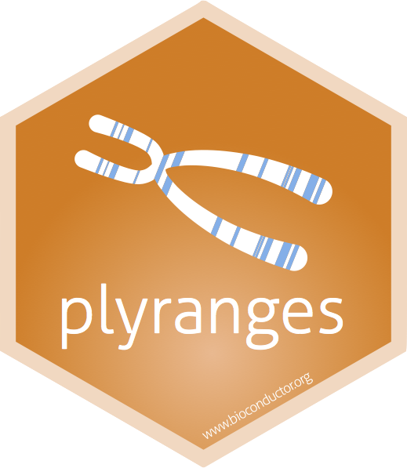

# plyranges: fluent genomic data analysis 

<!-- badges: start -->

[](https://github.com/tidyomics/plyranges/actions?query=workflow%3AR-CMD-check-bioc)
[](https://bioconductor.org/checkResults/release/bioc-LATEST/plyranges)

<!-- badges: end -->

_plyranges_ provides a consistent interface for importing and wrangling genomics
data from a variety of sources. The package defines a grammar of genomic
data transformation based on _dplyr_ and the Bioconductor packages
_IRanges_, _GenomicRanges_, and _rtracklayer_. It does this by providing
a set of verbs for developing analysis pipelines based on _GRanges_
objects that represent genomic regions:

- Modify genomic regions with the `mutate()` and `stretch()` functions.
- Modify genomic regions while fixing the start/end/center coordinates
  with the `anchor_` family of functions.
- Sort genomic ranges with `arrange()`.
- Modify, subset, and aggregate genomic data with the `mutate()`,
  `filter()`, and `summarise()`functions.
- Any of the above operations can be performed on partitions of the data
  with `group_by()`.
- Find nearest neighbour genomic regions with the `join_nearest_` family
  of functions.
- Find overlaps between ranges with the `join_overlaps_` family of
  functions.
- Add additional metadata between ranges and a table with the `join_mcols_` 
  family of functions.
- Merge all overlapping and adjacent genomic regions with
  `reduce_ranges()`.
- Merge the end points of all genomic regions with `disjoin_ranges()`.
- Import and write common genomic data formats with the `read_/write_`
  family of functions.

# Documentation

For more details on the features of _plyranges_, read the 
[introductory vignette](https://tidyomics.github.io/plyranges/articles/an-introduction.html)
and the
[examples vignette](https://tidyomics.github.io/plyranges/articles/more-examples.html).

For a complete case-study on using _plyranges_ to combine ATAC-seq and
RNA-seq results read the [*fluentGenomics*
workflow](https://tidyomics.github.io/fluentGenomics).

_plyranges_ is part of the [tidyomics](https://github.com/tidyomics)
project, providing a _dplyr_-based interface for many types of
genomics datasets represented in Bioconductor.

# Installation

_plyranges_ can be installed from the latest Bioconductor release:

``` r
# install.packages("BiocManager")
BiocManager::install("plyranges")
```

To install the development version from GitHub:

``` r
BiocManager::install("tidyomics/plyranges")
```

# Learning more

In addition to the two package vignettes, see the following for more informtion:

- The [fluentGenomics workflow](https://sa-lee.github.io/fluentGenomics) 
  package shows how to combine differential gene expression and differential
  chromatin accessibility using _plyranges_.

- The [extended vignette in the plyrangesWorkshops
  package](https://github.com/sa-lee/plyrangesWorkshops) has a detailed
  walk through of using _plyranges_ for coverage analysis.

- The collection of genomic range applications including _plyranges_:
  [tidy ranges tutorial](https://tidyomics.github.io/tidy-ranges-tutorial).

# Citation

If you found _plyranges_ useful for your work please cite our
[paper](http://doi.org/10.1186/s13059-018-1597-8):

    @ARTICLE{Lee2019,
      title    = "plyranges: a grammar of genomic data transformation",
      author   = "Lee, Stuart and Cook, Dianne and Lawrence, Michael",
      journal  = "Genome Biol.",
      volume   =  20,
      number   =  1,
      pages    = "4",
      month    =  jan,
      year     =  2019,
      url      = "http://dx.doi.org/10.1186/s13059-018-1597-8",
      doi      = "10.1186/s13059-018-1597-8",
      pmc      = "PMC6320618"
    }

# Contributing

We welcome contributions from the R/Bioconductor community. We ask that
contributors follow the [code of conduct](.github/CODE_OF_CONDUCT.md)
and the guide outlined [here](.github/CONTRIBUTING.md).
