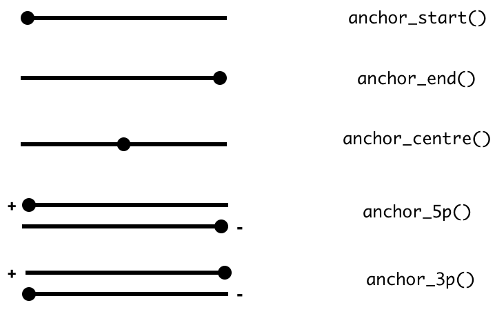
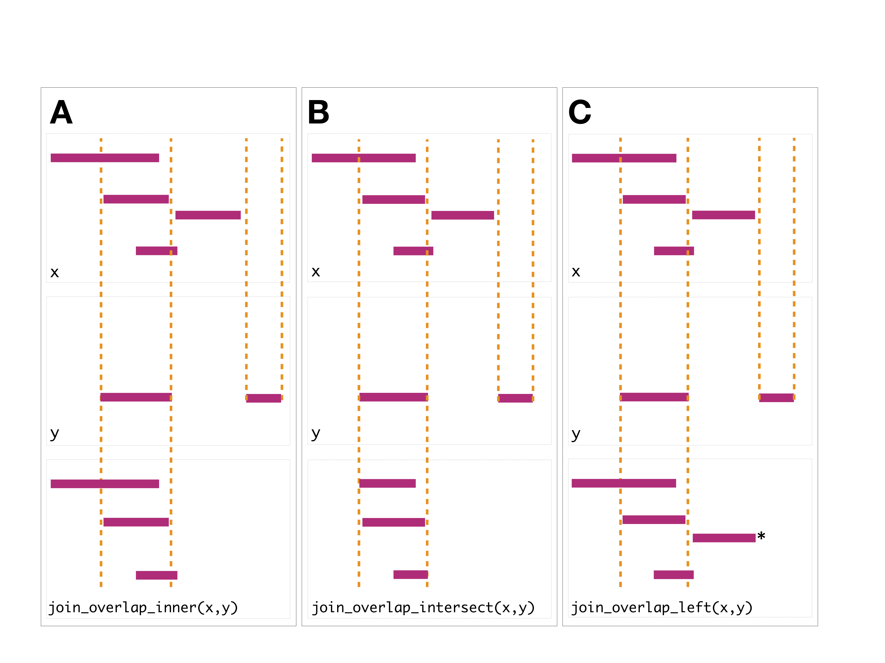
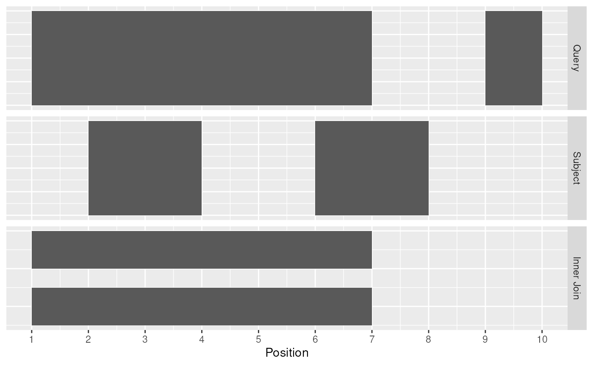
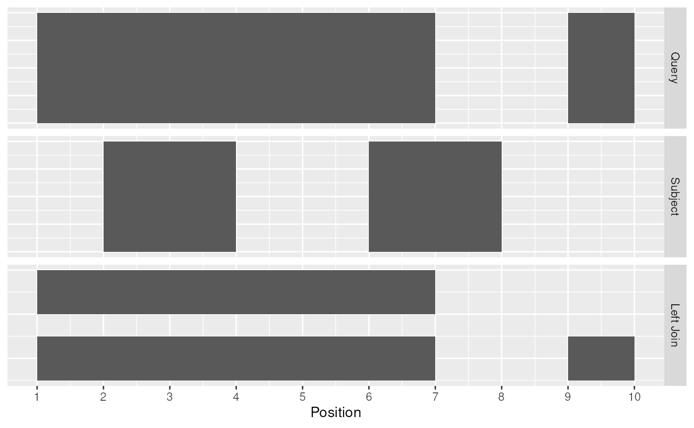
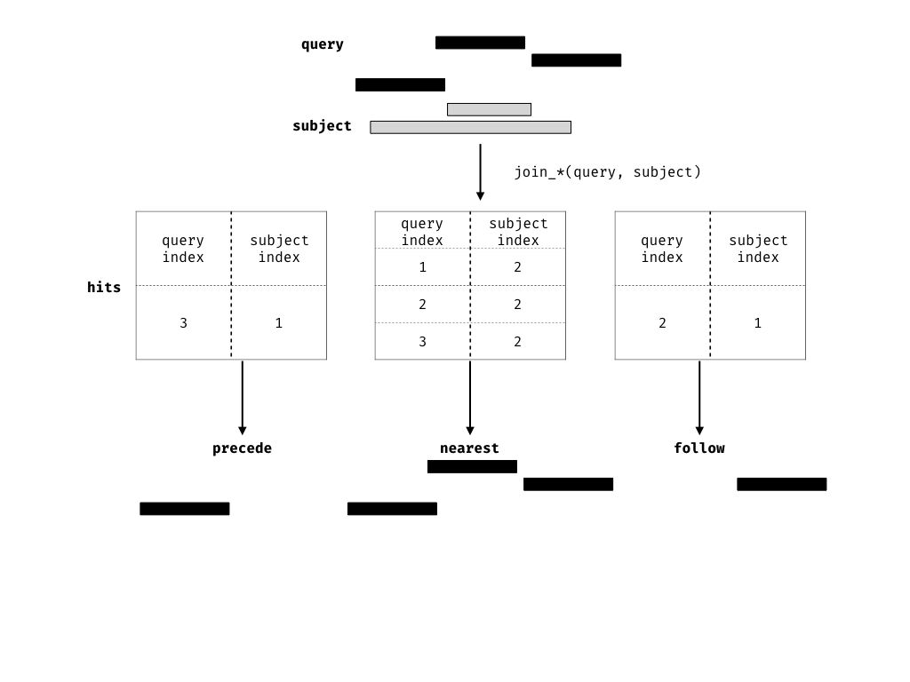

# Getting started with the plyranges package

## `Ranges` revisited

In Bioconductor there are two classes, `IRanges` and `GRanges`, that are
standard data structures for representing genomics data. Throughout this
document I refer to either of these classes as `Ranges` if an operation
can be performed on either class, otherwise I explicitly mention if a
function is appropriate for an `IRanges` or `GRanges`.

`Ranges` objects can either represent sets of integers as `IRanges`
(which have start, end and width attributes) or represent genomic
intervals (which have additional attributes, sequence name, and strand)
as `GRanges`. In addition, both types of `Ranges` can store information
about their intervals as metadata columns (for example GC content over a
genomic interval).

`Ranges` objects follow the tidy data principle: each row of a `Ranges`
object corresponds to an interval, while each column will represent a
variable about that interval, and generally each object will represent a
single unit of observation (like gene annotations).

Consequently, `Ranges` objects provide a powerful representation for
reasoning about genomic data. In this vignette, you will learn more
about `Ranges` objects and how via grouping, restriction and
summarisation you can perform common data tasks.

## Constructing `Ranges`

To construct an `IRanges` we require that there are at least two columns
that represent at either a starting coordinate, finishing coordinate or
the width of the interval.

``` r

suppressPackageStartupMessages(library(plyranges))
set.seed(100)
df <- data.frame(start=c(2:-1, 13:15),
                 width=c(0:3, 2:0))

# produces IRanges
rng <- df %>% as_iranges()
rng
```

    ## IRanges object with 7 ranges and 0 metadata columns:
    ##           start       end     width
    ##       <integer> <integer> <integer>
    ##   [1]         2         1         0
    ##   [2]         1         1         1
    ##   [3]         0         1         2
    ##   [4]        -1         1         3
    ##   [5]        13        14         2
    ##   [6]        14        14         1
    ##   [7]        15        14         0

To construct a `GRanges` we require a column that represents that
sequence name ( contig or chromosome id), and an optional column to
represent the strandedness of an interval.

``` r

# seqname is required for GRanges, metadata is automatically kept
grng <- df %>%
  transform(seqnames = sample(c("chr1", "chr2"), 7, replace = TRUE),
         strand = sample(c("+", "-"), 7, replace = TRUE),
         gc = runif(7)) %>%
  as_granges()

grng
```

    ## GRanges object with 7 ranges and 1 metadata column:
    ##       seqnames    ranges strand |        gc
    ##          <Rle> <IRanges>  <Rle> | <numeric>
    ##   [1]     chr2       2-1      - |  0.762551
    ##   [2]     chr1         1      - |  0.669022
    ##   [3]     chr2       0-1      + |  0.204612
    ##   [4]     chr2      -1-1      - |  0.357525
    ##   [5]     chr1     13-14      - |  0.359475
    ##   [6]     chr1        14      - |  0.690291
    ##   [7]     chr2     15-14      - |  0.535811
    ##   -------
    ##   seqinfo: 2 sequences from an unspecified genome; no seqlengths

## Arithmetic on Ranges

Sometimes you want to modify a genomic interval by altering the width of
the interval while leaving the start, end or midpoint of the coordinates
unaltered. This is achieved with the `mutate` verb along with `anchor_*`
adverbs.

The act of anchoring fixes either the start, end, center coordinates of
the `Range` object, as shown in the figure and code below and anchors
are used in combination with either `mutate` or `stretch`. By default,
the start coordinate will be anchored, so regardless of strand. For
behavior similar to
[`GenomicRanges::resize`](https://rdrr.io/pkg/IRanges/man/intra-range-methods.html),
use `anchor_5p`.



``` r

rng <- as_iranges(data.frame(start=c(1, 2, 3), end=c(5, 2, 8)))
grng <- as_granges(data.frame(start=c(1, 2, 3), end=c(5, 2, 8),
                          seqnames = "seq1",
                          strand = c("+", "*", "-")))
mutate(rng, width = 10)
```

    ## IRanges object with 3 ranges and 0 metadata columns:
    ##           start       end     width
    ##       <integer> <integer> <integer>
    ##   [1]         1        10        10
    ##   [2]         2        11        10
    ##   [3]         3        12        10

``` r

mutate(anchor_start(rng), width = 10)
```

    ## IRanges object with 3 ranges and 0 metadata columns:
    ##           start       end     width
    ##       <integer> <integer> <integer>
    ##   [1]         1        10        10
    ##   [2]         2        11        10
    ##   [3]         3        12        10

``` r

mutate(anchor_end(rng), width = 10)
```

    ## IRanges object with 3 ranges and 0 metadata columns:
    ##           start       end     width
    ##       <integer> <integer> <integer>
    ##   [1]        -4         5        10
    ##   [2]        -7         2        10
    ##   [3]        -1         8        10

``` r

mutate(anchor_center(rng), width = 10)
```

    ## IRanges object with 3 ranges and 0 metadata columns:
    ##           start       end     width
    ##       <integer> <integer> <integer>
    ##   [1]        -2         7        10
    ##   [2]        -3         6        10
    ##   [3]         1        10        10

``` r

mutate(anchor_3p(grng), width = 10) # leave negative strand fixed
```

    ## GRanges object with 3 ranges and 0 metadata columns:
    ##       seqnames    ranges strand
    ##          <Rle> <IRanges>  <Rle>
    ##   [1]     seq1      -4-5      +
    ##   [2]     seq1      -7-2      *
    ##   [3]     seq1      3-12      -
    ##   -------
    ##   seqinfo: 1 sequence from an unspecified genome; no seqlengths

``` r

mutate(anchor_5p(grng), width = 10) # leave positive strand fixed
```

    ## GRanges object with 3 ranges and 0 metadata columns:
    ##       seqnames    ranges strand
    ##          <Rle> <IRanges>  <Rle>
    ##   [1]     seq1      1-10      +
    ##   [2]     seq1      2-11      *
    ##   [3]     seq1      -1-8      -
    ##   -------
    ##   seqinfo: 1 sequence from an unspecified genome; no seqlengths

Similarly, you can modify the width of an interval using the `stretch`
verb. Without anchoring, this function will extend the interval in
either direction by an integer amount. With anchoring, either the start,
end or midpoint are preserved.

``` r

rng2 <- stretch(anchor_center(rng), 10)
rng2
```

    ## IRanges object with 3 ranges and 0 metadata columns:
    ##           start       end     width
    ##       <integer> <integer> <integer>
    ##   [1]        -4        10        15
    ##   [2]        -3         7        11
    ##   [3]        -2        13        16

``` r

stretch(anchor_end(rng2), 10)
```

    ## IRanges object with 3 ranges and 0 metadata columns:
    ##           start       end     width
    ##       <integer> <integer> <integer>
    ##   [1]       -14        10        25
    ##   [2]       -13         7        21
    ##   [3]       -12        13        26

``` r

stretch(anchor_start(rng2), 10)
```

    ## IRanges object with 3 ranges and 0 metadata columns:
    ##           start       end     width
    ##       <integer> <integer> <integer>
    ##   [1]        -4        20        25
    ##   [2]        -3        17        21
    ##   [3]        -2        23        26

``` r

stretch(anchor_3p(grng), 10)
```

    ## GRanges object with 3 ranges and 0 metadata columns:
    ##       seqnames    ranges strand
    ##          <Rle> <IRanges>  <Rle>
    ##   [1]     seq1      -9-5      +
    ##   [2]     seq1      -8-2      *
    ##   [3]     seq1      3-18      -
    ##   -------
    ##   seqinfo: 1 sequence from an unspecified genome; no seqlengths

``` r

stretch(anchor_5p(grng), 10)
```

    ## GRanges object with 3 ranges and 0 metadata columns:
    ##       seqnames    ranges strand
    ##          <Rle> <IRanges>  <Rle>
    ##   [1]     seq1      1-15      +
    ##   [2]     seq1      2-12      *
    ##   [3]     seq1      -7-8      -
    ##   -------
    ##   seqinfo: 1 sequence from an unspecified genome; no seqlengths

`Ranges` can be shifted left or right. If strand information is
available we can also shift upstream or downstream.

``` r

shift_left(rng, 100)
```

    ## IRanges object with 3 ranges and 0 metadata columns:
    ##           start       end     width
    ##       <integer> <integer> <integer>
    ##   [1]       -99       -95         5
    ##   [2]       -98       -98         1
    ##   [3]       -97       -92         6

``` r

shift_right(rng, 100)
```

    ## IRanges object with 3 ranges and 0 metadata columns:
    ##           start       end     width
    ##       <integer> <integer> <integer>
    ##   [1]       101       105         5
    ##   [2]       102       102         1
    ##   [3]       103       108         6

``` r

shift_upstream(grng, 100)
```

    ## GRanges object with 3 ranges and 0 metadata columns:
    ##       seqnames    ranges strand
    ##          <Rle> <IRanges>  <Rle>
    ##   [1]     seq1   -99--95      +
    ##   [2]     seq1       -98      *
    ##   [3]     seq1   103-108      -
    ##   -------
    ##   seqinfo: 1 sequence from an unspecified genome; no seqlengths

``` r

shift_downstream(grng, 100)
```

    ## GRanges object with 3 ranges and 0 metadata columns:
    ##       seqnames    ranges strand
    ##          <Rle> <IRanges>  <Rle>
    ##   [1]     seq1   101-105      +
    ##   [2]     seq1       102      *
    ##   [3]     seq1   -97--92      -
    ##   -------
    ##   seqinfo: 1 sequence from an unspecified genome; no seqlengths

## Grouping `Ranges`

`plyranges` introduces a new class of `Ranges` called `RangesGrouped`,
this is a similar idea to the grouped `data.frame\tibble` in `dplyr`.

Grouping can act on either the core components or the metadata columns
of a `Ranges` object.

It is most effective when combined with other verbs such as
[`mutate()`](https://dplyr.tidyverse.org/reference/mutate.html),
[`summarise()`](https://dplyr.tidyverse.org/reference/summarise.html),
[`filter()`](https://dplyr.tidyverse.org/reference/filter.html),
[`reduce_ranges()`](https://tidyomics.github.io/plyranges/reference/ranges-reduce.md)
or
[`disjoin_ranges()`](https://tidyomics.github.io/plyranges/reference/ranges-disjoin.md).

``` r

grng <- data.frame(seqnames = sample(c("chr1", "chr2"), 7, replace = TRUE),
         strand = sample(c("+", "-"), 7, replace = TRUE),
         gc = runif(7),
         start = 1:7,
         width = 10) %>%
  as_granges()

grng_by_strand <- grng %>%
  group_by(strand)

grng_by_strand
```

    ## GRanges object with 7 ranges and 1 metadata column:
    ## Groups: strand [2]
    ##       seqnames    ranges strand |        gc
    ##          <Rle> <IRanges>  <Rle> | <numeric>
    ##   [1]     chr2      1-10      - |  0.889454
    ##   [2]     chr2      2-11      + |  0.180407
    ##   [3]     chr1      3-12      - |  0.629391
    ##   [4]     chr2      4-13      + |  0.989564
    ##   [5]     chr1      5-14      - |  0.130289
    ##   [6]     chr1      6-15      - |  0.330661
    ##   [7]     chr2      7-16      - |  0.865121
    ##   -------
    ##   seqinfo: 2 sequences from an unspecified genome; no seqlengths

## Restricting `Ranges`

The verb `filter` can be used to restrict rows in the `Ranges`. Note
that grouping will cause the `filter` to act within each group of the
data.

``` r

grng %>% filter(gc < 0.3)
```

    ## GRanges object with 2 ranges and 1 metadata column:
    ##       seqnames    ranges strand |        gc
    ##          <Rle> <IRanges>  <Rle> | <numeric>
    ##   [1]     chr2      2-11      + |  0.180407
    ##   [2]     chr1      5-14      - |  0.130289
    ##   -------
    ##   seqinfo: 2 sequences from an unspecified genome; no seqlengths

``` r

# filtering by group
grng_by_strand %>% filter(gc == max(gc))
```

    ## GRanges object with 2 ranges and 1 metadata column:
    ## Groups: strand [2]
    ##       seqnames    ranges strand |        gc
    ##          <Rle> <IRanges>  <Rle> | <numeric>
    ##   [1]     chr2      1-10      - |  0.889454
    ##   [2]     chr2      4-13      + |  0.989564
    ##   -------
    ##   seqinfo: 2 sequences from an unspecified genome; no seqlengths

We also provide the convenience methods `filter_by_overlaps` and
`filter_by_non_overlaps` for restricting by any overlapping `Ranges`.

``` r

ir0 <- data.frame(start = c(5,10, 15,20), width = 5) %>%
  as_iranges()
ir1 <- data.frame(start = 2:6, width = 3:7) %>%
  as_iranges()
ir0
```

    ## IRanges object with 4 ranges and 0 metadata columns:
    ##           start       end     width
    ##       <integer> <integer> <integer>
    ##   [1]         5         9         5
    ##   [2]        10        14         5
    ##   [3]        15        19         5
    ##   [4]        20        24         5

``` r

ir1
```

    ## IRanges object with 5 ranges and 0 metadata columns:
    ##           start       end     width
    ##       <integer> <integer> <integer>
    ##   [1]         2         4         3
    ##   [2]         3         6         4
    ##   [3]         4         8         5
    ##   [4]         5        10         6
    ##   [5]         6        12         7

``` r

ir0 %>% filter_by_overlaps(ir1)
```

    ## IRanges object with 2 ranges and 0 metadata columns:
    ##           start       end     width
    ##       <integer> <integer> <integer>
    ##   [1]         5         9         5
    ##   [2]        10        14         5

``` r

ir0 %>% filter_by_non_overlaps(ir1)
```

    ## IRanges object with 2 ranges and 0 metadata columns:
    ##           start       end     width
    ##       <integer> <integer> <integer>
    ##   [1]        15        19         5
    ##   [2]        20        24         5

## Summarising `Ranges`

The `summarise` function will return a `DataFrame` because the
information required to return a `Ranges` object is lost. It is often
most useful to use
[`summarise()`](https://dplyr.tidyverse.org/reference/summarise.html) in
combination with the
[`group_by()`](https://dplyr.tidyverse.org/reference/group_by.html)
family of functions.

``` r

ir1 <- ir1 %>%
  mutate(gc = runif(length(.)))

ir0 %>%
  group_by_overlaps(ir1) %>%
  summarise(gc = mean(gc))
```

    ## DataFrame with 2 rows and 2 columns
    ##       query        gc
    ##   <integer> <numeric>
    ## 1         1  0.675555
    ## 2         2  0.635795

## Joins, or another way at looking at overlaps between `Ranges`

A join acts on two GRanges objects, a query and a subject.

``` r

query <- data.frame(seqnames = "chr1",
               strand = c("+", "-"),
               start = c(1, 9),
               end =  c(7, 10),
               key.a = letters[1:2]) %>%
  as_granges()

subject <- data.frame(seqnames = "chr1",
               strand = c("-", "+"),
               start = c(2, 6),
               end = c(4, 8),
               key.b = LETTERS[1:2]) %>%
  as_granges()
```


Query and Subject Ranges

The join operator is relational in the sense that metadata from the
query and subject ranges is retained in the joined range. All join
operators in the `plyranges` DSL generate a set of hits based on overlap
or proximity of ranges and use those hits to merge the two datasets in
different ways. There are four supported matching algorithms: *overlap*,
*nearest*, *precede*, and *follow*. We can further restrict the matching
by whether the query is completely *within* the subject, and adding the
*directed* suffix ensures that matching ranges have the same direction
(strand).



The first function,
[`join_overlap_intersect()`](https://tidyomics.github.io/plyranges/reference/overlap-joins.md)
will return a `Ranges` object where the start, end, and width
coordinates correspond to the amount of any overlap between the left and
right input `Ranges`. It also returns any metadatain the subject range
if the subject overlaps the query.

``` r

intersect_rng <- join_overlap_intersect(query, subject)
intersect_rng
```

    ## GRanges object with 2 ranges and 2 metadata columns:
    ##       seqnames    ranges strand |       key.a       key.b
    ##          <Rle> <IRanges>  <Rle> | <character> <character>
    ##   [1]     chr1       2-4      + |           a           A
    ##   [2]     chr1       6-7      + |           a           B
    ##   -------
    ##   seqinfo: 1 sequence from an unspecified genome; no seqlengths


Intersect Join

The
[`join_overlap_inner()`](https://tidyomics.github.io/plyranges/reference/overlap-joins.md)
function will return the `Ranges` in the query that overlap any `Ranges`
in the subject. Like the
[`join_overlap_intersect()`](https://tidyomics.github.io/plyranges/reference/overlap-joins.md)
function metadata of the subject `Range` is returned if it overlaps the
query.

``` r

inner_rng <- join_overlap_inner(query, subject)
inner_rng
```

    ## GRanges object with 2 ranges and 2 metadata columns:
    ##       seqnames    ranges strand |       key.a       key.b
    ##          <Rle> <IRanges>  <Rle> | <character> <character>
    ##   [1]     chr1       1-7      + |           a           A
    ##   [2]     chr1       1-7      + |           a           B
    ##   -------
    ##   seqinfo: 1 sequence from an unspecified genome; no seqlengths



Inner Join

We also provide a convenience method called `find_overlaps` that
computes the same result as
[`join_overlap_inner()`](https://tidyomics.github.io/plyranges/reference/overlap-joins.md).

``` r

find_overlaps(query, subject)
```

    ## GRanges object with 2 ranges and 2 metadata columns:
    ##       seqnames    ranges strand |       key.a       key.b
    ##          <Rle> <IRanges>  <Rle> | <character> <character>
    ##   [1]     chr1       1-7      + |           a           A
    ##   [2]     chr1       1-7      + |           a           B
    ##   -------
    ##   seqinfo: 1 sequence from an unspecified genome; no seqlengths

The
[`join_overlap_left()`](https://tidyomics.github.io/plyranges/reference/overlap-joins.md)
method will perform an outer left join.

First any overlaps that are found will be returned similar to
[`join_overlap_inner()`](https://tidyomics.github.io/plyranges/reference/overlap-joins.md).
Then any non-overlapping ranges will be returned, with missing values on
the metadata columns.

``` r

left_rng <- join_overlap_left(query, subject)
left_rng
```

    ## GRanges object with 3 ranges and 2 metadata columns:
    ##       seqnames    ranges strand |       key.a       key.b
    ##          <Rle> <IRanges>  <Rle> | <character> <character>
    ##   [1]     chr1       1-7      + |           a           A
    ##   [2]     chr1       1-7      + |           a           B
    ##   [3]     chr1      9-10      - |           b        <NA>
    ##   -------
    ##   seqinfo: 1 sequence from an unspecified genome; no seqlengths



Left Join

Compared with
[`filter_by_overlaps()`](https://tidyomics.github.io/plyranges/reference/ranges-filter-overlaps.md)
above, the overlap left join expands the `Ranges` to give information
about each interval on the query `Ranges` that overlap those on the
subject `Ranges` as well as the intervals on the left that do not
overlap any range on the right.

### Finding your neighbours

We also provide methods for finding nearest, preceding or following
`Ranges`. Conceptually this is identical to our approach for finding
overlaps, except the semantics of the join are different.



``` r

join_nearest(ir0, ir1)
```

    ## IRanges object with 4 ranges and 1 metadata column:
    ##           start       end     width |        gc
    ##       <integer> <integer> <integer> | <numeric>
    ##   [1]         5         9         5 |  0.780359
    ##   [2]        10        14         5 |  0.780359
    ##   [3]        15        19         5 |  0.780359
    ##   [4]        20        24         5 |  0.780359

``` r

join_follow(ir0, ir1)
```

    ## IRanges object with 4 ranges and 1 metadata column:
    ##           start       end     width |        gc
    ##       <integer> <integer> <integer> | <numeric>
    ##   [1]         5         9         5 |  0.777584
    ##   [2]        10        14         5 |  0.603324
    ##   [3]        15        19         5 |  0.780359
    ##   [4]        20        24         5 |  0.780359

``` r

join_precede(ir0, ir1) # nothing precedes returns empty `Ranges`
```

    ## IRanges object with 0 ranges and 1 metadata column:
    ##        start       end     width |        gc
    ##    <integer> <integer> <integer> | <numeric>

``` r

join_precede(ir1, ir0)
```

    ## IRanges object with 5 ranges and 1 metadata column:
    ##           start       end     width |        gc
    ##       <integer> <integer> <integer> | <numeric>
    ##   [1]         2         4         3 |  0.777584
    ##   [2]         3         6         4 |  0.827303
    ##   [3]         4         8         5 |  0.603324
    ##   [4]         5        10         6 |  0.491232
    ##   [5]         6        12         7 |  0.780359

### Example: dealing with multi-mapping

This example is taken from the Bioconductor support
[site](https://support.bioconductor.org/p/100046/).

We have two `Ranges` objects. The first contains single nucleotide
positions corresponding to an intensity measurement such as a ChiP-seq
experiment, while the other contains coordinates for two genes of
interest.

We want to identify which positions in the `intensities` `Ranges`
overlap the genes, where each row corresponds to a position that
overlaps a single gene.

First we create the two `Ranges` objects

``` r

intensities <- data.frame(seqnames = "VI",
                          start = c(3320:3321,3330:3331,3341:3342),
                          width = 1) %>%
  as_granges()

intensities
```

    ## GRanges object with 6 ranges and 0 metadata columns:
    ##       seqnames    ranges strand
    ##          <Rle> <IRanges>  <Rle>
    ##   [1]       VI      3320      *
    ##   [2]       VI      3321      *
    ##   [3]       VI      3330      *
    ##   [4]       VI      3331      *
    ##   [5]       VI      3341      *
    ##   [6]       VI      3342      *
    ##   -------
    ##   seqinfo: 1 sequence from an unspecified genome; no seqlengths

``` r

genes <- data.frame(seqnames = "VI",
                    start = c(3322, 3030),
                    end = c(3846, 3338),
                    gene_id=c("YFL064C", "YFL065C")) %>%
  as_granges()

genes
```

    ## GRanges object with 2 ranges and 1 metadata column:
    ##       seqnames    ranges strand |     gene_id
    ##          <Rle> <IRanges>  <Rle> | <character>
    ##   [1]       VI 3322-3846      * |     YFL064C
    ##   [2]       VI 3030-3338      * |     YFL065C
    ##   -------
    ##   seqinfo: 1 sequence from an unspecified genome; no seqlengths

Now to find where the positions overlap each gene, we can perform an
overlap join. This will automatically carry over the gene_id information
as well as their coordinates (we can drop those by only selecting the
gene_id).

``` r

olap <- join_overlap_inner(intensities, genes) %>%
  select(gene_id)
olap
```

    ## GRanges object with 8 ranges and 1 metadata column:
    ##       seqnames    ranges strand |     gene_id
    ##          <Rle> <IRanges>  <Rle> | <character>
    ##   [1]       VI      3320      * |     YFL065C
    ##   [2]       VI      3321      * |     YFL065C
    ##   [3]       VI      3330      * |     YFL065C
    ##   [4]       VI      3330      * |     YFL064C
    ##   [5]       VI      3331      * |     YFL065C
    ##   [6]       VI      3331      * |     YFL064C
    ##   [7]       VI      3341      * |     YFL064C
    ##   [8]       VI      3342      * |     YFL064C
    ##   -------
    ##   seqinfo: 1 sequence from an unspecified genome; no seqlengths

Several positions match to both genes. We can count them using
`summarise` and grouping by the `start` position:

``` r

olap %>%
  group_by(start) %>%
  summarise(n = n())
```

    ## DataFrame with 6 rows and 2 columns
    ##       start         n
    ##   <integer> <integer>
    ## 1      3320         1
    ## 2      3321         1
    ## 3      3330         2
    ## 4      3331         2
    ## 5      3341         1
    ## 6      3342         1

### Grouping by overlaps

It’s also possible to group by overlaps. Using this approach we can
count the number of overlaps that are greater than 0.

``` r

grp_by_olap <- ir0 %>%
  group_by_overlaps(ir1)
grp_by_olap
```

    ## IRanges object with 6 ranges and 2 metadata columns:
    ## Groups: query [2]
    ##           start       end     width |        gc     query
    ##       <integer> <integer> <integer> | <numeric> <integer>
    ##   [1]         5         9         5 |  0.827303         1
    ##   [2]         5         9         5 |  0.603324         1
    ##   [3]         5         9         5 |  0.491232         1
    ##   [4]         5         9         5 |  0.780359         1
    ##   [5]        10        14         5 |  0.491232         2
    ##   [6]        10        14         5 |  0.780359         2

``` r

grp_by_olap %>%
  mutate(n_overlaps = n())
```

    ## IRanges object with 6 ranges and 3 metadata columns:
    ## Groups: query [2]
    ##           start       end     width |        gc     query n_overlaps
    ##       <integer> <integer> <integer> | <numeric> <integer>  <integer>
    ##   [1]         5         9         5 |  0.827303         1          4
    ##   [2]         5         9         5 |  0.603324         1          4
    ##   [3]         5         9         5 |  0.491232         1          4
    ##   [4]         5         9         5 |  0.780359         1          4
    ##   [5]        10        14         5 |  0.491232         2          2
    ##   [6]        10        14         5 |  0.780359         2          2

Of course we can also add overlap counts via the
[`count_overlaps()`](https://tidyomics.github.io/plyranges/reference/ranges-count-overlaps.md)
function.

``` r

ir0 %>%
  mutate(n_overlaps = count_overlaps(., ir1))
```

    ## IRanges object with 4 ranges and 1 metadata column:
    ##           start       end     width | n_overlaps
    ##       <integer> <integer> <integer> |  <integer>
    ##   [1]         5         9         5 |          4
    ##   [2]        10        14         5 |          2
    ##   [3]        15        19         5 |          0
    ##   [4]        20        24         5 |          0

## Data Import/Output

We provide convenience functions via `rtracklayer` and
`GenomicAlignments` for reading/writing the following data formats
to/from `Ranges` objects.

| `plyranges` functions | File Format |
|----|----|
| [`read_bam()`](https://tidyomics.github.io/plyranges/reference/io-bam-read.md) | BAM |
| [`read_bed()`](https://tidyomics.github.io/plyranges/reference/io-bed-read.md)/[`write_bed()`](https://tidyomics.github.io/plyranges/reference/io-bed-write.md) | BED |
| [`read_bed_graph()`](https://tidyomics.github.io/plyranges/reference/io-bed-read.md)/ [`write_bed_graph()`](https://tidyomics.github.io/plyranges/reference/io-bed-write.md) | BEDGraph |
| [`read_narrowpeaks()`](https://tidyomics.github.io/plyranges/reference/io-bed-read.md)/[`write_narrowpeaks()`](https://tidyomics.github.io/plyranges/reference/io-bed-write.md) | narrowPeaks |
| [`read_gff()`](https://tidyomics.github.io/plyranges/reference/io-gff-read.md) / [`write_gff()`](https://tidyomics.github.io/plyranges/reference/io-gff-write.md) | GFF(1-3)/ GTF |
| [`read_bigwig()`](https://tidyomics.github.io/plyranges/reference/io-bigwig-read.md) / [`write_bigwig()`](https://tidyomics.github.io/plyranges/reference/io-bigwig-write.md) | BigWig |
| [`read_wig()`](https://tidyomics.github.io/plyranges/reference/io-wig-read.md) /[`write_wig()`](https://tidyomics.github.io/plyranges/reference/io-wig-write.md) | Wig |

## Learning more

There are many other resources and workshops available to learn to use
`plyranges` and related Bioconductor packages, especially for more
realistic analyses than the ones covered here:

- The
  [fluentGenomics](https://bioconductor.org/packages/release/workflows/html/fluentGenomics.html)
  workflow package is an end-to-end workflow package for integrating
  differential expression results with differential accessibility
  results.
- The [Bioc 2018 Workshop
  book](https://bioconductor.github.io/BiocWorkshops/fluent-genomic-data-analysis-with-plyranges.html)
  has worked examples of using `plyranges` to analyse publicly available
  genomics data.
- The [extended vignette in the plyrangesWorkshops
  package](https://github.com/sa-lee/plyrangesWorkshops) has a detailed
  walk through of using plyranges for coverage analysis.
- The [case
  study](https://github.com/mikelove/plyrangesTximetaCaseStudy) by
  Michael Love using plyranges with
  [tximeta](https://bioconductor.org/packages/release/bioc/html/tximeta.html)
  to follow up on interesting hits from a combined RNA-seq and ATAC-seq
  analysis.
- The [journal
  article](https://genomebiology.biomedcentral.com/articles/10.1186/s13059-018-1597-8)
  ([preprint
  here](https://www.biorxiv.org/content/early/2018/05/23/327841)) has
  details about the overall philosophy and design of plyranges.

## Appendix

``` r

sessionInfo()
```

    ## R version 4.5.2 (2025-10-31)
    ## Platform: x86_64-pc-linux-gnu
    ## Running under: Ubuntu 24.04.3 LTS
    ## 
    ## Matrix products: default
    ## BLAS:   /usr/lib/x86_64-linux-gnu/openblas-pthread/libblas.so.3 
    ## LAPACK: /usr/lib/x86_64-linux-gnu/openblas-pthread/libopenblasp-r0.3.26.so;  LAPACK version 3.12.0
    ## 
    ## locale:
    ##  [1] LC_CTYPE=en_US.UTF-8       LC_NUMERIC=C              
    ##  [3] LC_TIME=en_US.UTF-8        LC_COLLATE=en_US.UTF-8    
    ##  [5] LC_MONETARY=en_US.UTF-8    LC_MESSAGES=en_US.UTF-8   
    ##  [7] LC_PAPER=en_US.UTF-8       LC_NAME=C                 
    ##  [9] LC_ADDRESS=C               LC_TELEPHONE=C            
    ## [11] LC_MEASUREMENT=en_US.UTF-8 LC_IDENTIFICATION=C       
    ## 
    ## time zone: UTC
    ## tzcode source: system (glibc)
    ## 
    ## attached base packages:
    ## [1] stats4    stats     graphics  grDevices utils     datasets  methods  
    ## [8] base     
    ## 
    ## other attached packages:
    ##  [1] ggplot2_4.0.2        plyranges_1.31.3     dplyr_1.2.0         
    ##  [4] GenomicRanges_1.62.1 Seqinfo_1.0.0        IRanges_2.44.0      
    ##  [7] S4Vectors_0.48.0     BiocGenerics_0.56.0  generics_0.1.4      
    ## [10] BiocStyle_2.38.0    
    ## 
    ## loaded via a namespace (and not attached):
    ##  [1] SummarizedExperiment_1.40.0 gtable_0.3.6               
    ##  [3] rjson_0.2.23                xfun_0.56                  
    ##  [5] bslib_0.10.0                htmlwidgets_1.6.4          
    ##  [7] Biobase_2.70.0              lattice_0.22-9             
    ##  [9] vctrs_0.7.1                 tools_4.5.2                
    ## [11] bitops_1.0-9                curl_7.0.0                 
    ## [13] parallel_4.5.2              tibble_3.3.1               
    ## [15] pkgconfig_2.0.3             Matrix_1.7-4               
    ## [17] RColorBrewer_1.1-3          S7_0.2.1                   
    ## [19] desc_1.4.3                  cigarillo_1.0.0            
    ## [21] lifecycle_1.0.5             farver_2.1.2               
    ## [23] compiler_4.5.2              Rsamtools_2.26.0           
    ## [25] textshaping_1.0.5           Biostrings_2.78.0          
    ## [27] codetools_0.2-20            htmltools_0.5.9            
    ## [29] sass_0.4.10                 RCurl_1.98-1.17            
    ## [31] yaml_2.3.12                 pillar_1.11.1              
    ## [33] pkgdown_2.2.0               crayon_1.5.3               
    ## [35] jquerylib_0.1.4             BiocParallel_1.44.0        
    ## [37] DelayedArray_0.36.0         cachem_1.1.0               
    ## [39] abind_1.4-8                 tidyselect_1.2.1           
    ## [41] digest_0.6.39               restfulr_0.0.16            
    ## [43] bookdown_0.46               labeling_0.4.3             
    ## [45] fastmap_1.2.0               grid_4.5.2                 
    ## [47] cli_3.6.5                   SparseArray_1.10.9         
    ## [49] magrittr_2.0.4              S4Arrays_1.10.1            
    ## [51] XML_3.99-0.22               withr_3.0.2                
    ## [53] scales_1.4.0                rmarkdown_2.30             
    ## [55] XVector_0.50.0              httr_1.4.8                 
    ## [57] matrixStats_1.5.0           otel_0.2.0                 
    ## [59] ragg_1.5.1                  evaluate_1.0.5             
    ## [61] knitr_1.51                  BiocIO_1.20.0              
    ## [63] rtracklayer_1.70.1          rlang_1.1.7                
    ## [65] glue_1.8.0                  BiocManager_1.30.27        
    ## [67] jsonlite_2.0.0              R6_2.6.1                   
    ## [69] MatrixGenerics_1.22.0       GenomicAlignments_1.46.0   
    ## [71] systemfonts_1.3.2           fs_1.6.7
