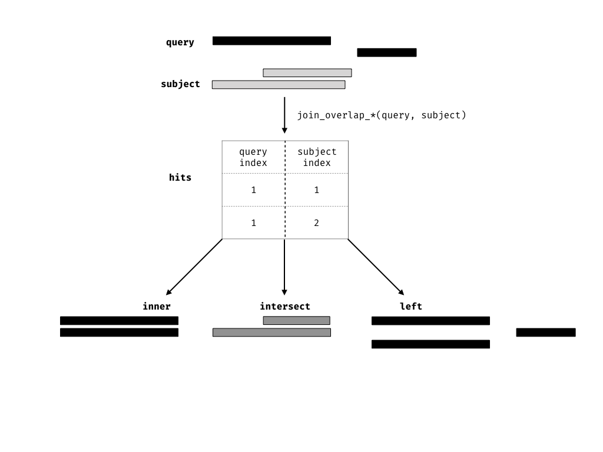

# `Ranges` revisited

In Bioconductor there are two classes, `IRanges` and `GRanges`, that are
standard data structures for representing genomics data.  Throughout this
document I refer to either of these classes as `Ranges` if an operation can be
performed on either class, otherwise I explicitly mention if a function is
appropriate for an `IRanges` or `GRanges`.

`Ranges` objects can either represent sets of integers as `IRanges` (which have
start, end and width attributes) or represent genomic intervals (which have
additional attributes, sequence name, and strand) as `GRanges`. In addition,
both types of `Ranges` can store information about their intervals as metadata
columns (for example GC content over a genomic interval).

`Ranges` objects follow the tidy data principle: each row of a `Ranges` object
corresponds to an interval, while each column will represent a variable about
that interval, and generally each object will represent a single unit of
observation (like gene annotations).

Consequently, `Ranges` objects provide a powerful representation for reasoning
about genomic data. In this vignette, you will learn more about `Ranges`
objects and how via grouping, restriction and summarisation you can perform
common data tasks.


# Constructing `Ranges`

To construct an `IRanges` we require that there are at least two columns that
represent at either a starting coordinate, finishing coordinate or the width of
the interval.

```{r}
suppressPackageStartupMessages(library(plyranges))
set.seed(100)
df <- data.frame(start=c(2:-1, 13:15),
                 width=c(0:3, 2:0))

# produces IRanges
rng <- df %>% as_iranges()
rng

```

To construct a `GRanges` we require a column that represents that sequence name
( contig or chromosome id), and an optional column to represent the
strandedness of an interval.

```{r}
# seqname is required for GRanges, metadata is automatically kept
grng <- df %>%
  transform(seqnames = sample(c("chr1", "chr2"), 7, replace = TRUE),
         strand = sample(c("+", "-"), 7, replace = TRUE),
         gc = runif(7)) %>%
  as_granges()

grng
```

# Arithmetic on Ranges

Sometimes you want to modify a genomic interval by altering the width of the
interval while leaving the start, end or midpoint of the coordinates unaltered.
This is achieved with the `mutate` verb along with `anchor_*` adverbs.

The act of anchoring fixes either the start, end, center coordinates of the
`Range` object, as shown in the figure and code below and anchors are used in
combination with either `mutate` or `stretch`.
By default, the start coordinate will be anchored, so regardless of strand. 
For behavior similar to `GenomicRanges::resize`, use `anchor_5p`.

```{r anchor_fig, echo = FALSE, out.width="400px", fig.align="center"}
knitr::include_graphics("anchors.png", dpi = 150)
```

```{r}
rng <- as_iranges(data.frame(start=c(1, 2, 3), end=c(5, 2, 8)))
grng <- as_granges(data.frame(start=c(1, 2, 3), end=c(5, 2, 8),
                          seqnames = "seq1",
                          strand = c("+", "*", "-")))
mutate(rng, width = 10)
mutate(anchor_start(rng), width = 10)
mutate(anchor_end(rng), width = 10)
mutate(anchor_center(rng), width = 10)
mutate(anchor_3p(grng), width = 10) # leave negative strand fixed
mutate(anchor_5p(grng), width = 10) # leave positive strand fixed
```

Similarly, you can modify the width of an interval using the `stretch` verb.
Without anchoring, this function will extend the interval in either direction
by an integer amount. With anchoring, either the start, end or midpoint are
preserved.

```{r}
rng2 <- stretch(anchor_center(rng), 10)
rng2
stretch(anchor_end(rng2), 10)
stretch(anchor_start(rng2), 10)
stretch(anchor_3p(grng), 10)
stretch(anchor_5p(grng), 10)
```

`Ranges` can be shifted left or right. If strand information is available we
can also shift upstream or downstream.

```{r}
shift_left(rng, 100)
shift_right(rng, 100)
shift_upstream(grng, 100)
shift_downstream(grng, 100)
```

# Grouping `Ranges`

`plyranges` introduces a new class of `Ranges` called `RangesGrouped`, this is
a similar idea to the grouped `data.frame\tibble` in `dplyr`.

Grouping can act on either the core components or the metadata columns of a
`Ranges` object.

It is most effective when combined with other verbs such as `mutate()`,
`summarise()`, `filter()`, `reduce_ranges()` or `disjoin_ranges()`.
```{r}
grng <- data.frame(seqnames = sample(c("chr1", "chr2"), 7, replace = TRUE),
         strand = sample(c("+", "-"), 7, replace = TRUE),
         gc = runif(7),
         start = 1:7,
         width = 10) %>%
  as_granges()

grng_by_strand <- grng %>%
  group_by(strand)

grng_by_strand
```

# Restricting `Ranges`

The verb `filter` can be used to restrict rows in the `Ranges`. Note that
grouping will cause the `filter` to act within each group of the data.
```{r}
grng %>% filter(gc < 0.3)
# filtering by group
grng_by_strand %>% filter(gc == max(gc))
```

We also provide the convenience methods `filter_by_overlaps` and
`filter_by_non_overlaps` for restricting by any overlapping `Ranges`.

```{r}
ir0 <- data.frame(start = c(5,10, 15,20), width = 5) %>%
  as_iranges()
ir1 <- data.frame(start = 2:6, width = 3:7) %>%
  as_iranges()
ir0
ir1
ir0 %>% filter_by_overlaps(ir1)
ir0 %>% filter_by_non_overlaps(ir1)
```

# Summarising `Ranges`

The `summarise` function will return a `DataFrame` because the information
required to return a `Ranges` object is lost. It is often most useful to use
`summarise()` in combination with the `group_by()` family of functions.

```{r}
ir1 <- ir1 %>%
  mutate(gc = runif(length(.)))

ir0 %>%
  group_by_overlaps(ir1) %>%
  summarise(gc = mean(gc))
```

# Joins, or another way at looking at overlaps between `Ranges`

A join acts on two GRanges objects, a query and a subject.

```{r}
query <- data.frame(seqnames = "chr1",
               strand = c("+", "-"),
               start = c(1, 9),
               end =  c(7, 10),
               key.a = letters[1:2]) %>%
  as_granges()

subject <- data.frame(seqnames = "chr1",
               strand = c("-", "+"),
               start = c(2, 6),
               end = c(4, 8),
               key.b = LETTERS[1:2]) %>%
  as_granges()
```

```{r olap, echo = FALSE, fig.cap = "Query and Subject Ranges", message = FALSE}
library(ggplot2)
query_df <- as.data.frame(query)[, -6]
query_df$key <- "Query"
subject_df <- as.data.frame(subject)[, -6]
subject_df$key <- "Subject"
melted_ranges <- rbind(query_df, subject_df)
ggplot(melted_ranges, aes(xmin = start, xmax = end, ymin = 1, ymax = 3)) +
  geom_rect() +
  facet_grid(key ~ .) +
  scale_x_continuous(breaks = seq(1, 10, by = 1)) +
  xlab("Position") +
  theme(axis.text.y = element_blank(),
        axis.ticks.y = element_blank(),
        axis.title.y = element_blank())
```

The join operator is relational in the sense that metadata from the query and
subject ranges is retained in the joined range.  All join operators in the
`plyranges` DSL generate a set of hits based on overlap or proximity of ranges
and use those hits to merge the two datasets in different ways.  There are four
supported matching algorithms: _overlap_, _nearest_, _precede_, and _follow_.
We can further restrict the matching by whether the query is completely
_within_ the subject, and adding the _directed_ suffix ensures that matching
ranges have the same direction (strand).


```{r olaps-diagram, echo = FALSE, out.width="600px"}

```

The first function, `join_overlap_intersect()` will return a `Ranges` object
where the start, end, and width coordinates correspond to the amount of any
overlap between the left and right input `Ranges`. It also returns any
metadatain the subject range if the subject overlaps the query.

```{r}
intersect_rng <- join_overlap_intersect(query, subject)
intersect_rng
```

```{r intersect-join, echo = FALSE, fig.cap="Intersect Join"}
intersect_df <- as.data.frame(intersect_rng)[, -c(6,7)]
intersect_df$key <- "Intersect Join"
melted_ranges <- rbind(query_df, subject_df, intersect_df)
melted_ranges$key <- factor(melted_ranges$key,
                              levels = c("Query", "Subject", "Intersect Join"))
ggplot(melted_ranges, aes(xmin = start, xmax = end, ymin = 1, ymax = 3)) +
  geom_rect() +
  facet_grid(key ~ .) +
  scale_x_continuous(breaks = seq(1, 10, by = 1)) +
  xlab("Position") +
  theme(axis.text.y = element_blank(),
        axis.ticks.y = element_blank(),
        axis.title.y = element_blank())
```


The `join_overlap_inner()` function will return the `Ranges` in the query that
overlap any `Ranges` in the subject. Like the `join_overlap_intersect()`
function metadata of the subject `Range` is returned if it overlaps the query.

```{r}
inner_rng <- join_overlap_inner(query, subject)
inner_rng
```


```{r inner-join, echo = FALSE, fig.cap = "Inner Join", message = FALSE}
inner_df <- as.data.frame(inner_rng)[, -c(6,7)]
inner_df$ymin <- c(1,4)
inner_df$ymax <- c(3,6)
inner_df$key <- "Inner Join"
melted_ranges <- rbind(query_df, subject_df)
melted_ranges$ymin <- 1
melted_ranges$ymax <- 3
melted_ranges <- rbind(melted_ranges, inner_df)
melted_ranges$key <- factor(melted_ranges$key,
                              levels = c("Query", "Subject", "Inner Join"))

ggplot(melted_ranges, aes(xmin = start, xmax = end, ymin = ymin, ymax = ymax)) +
  geom_rect() +
  facet_grid(key ~ ., scales = "free_y") +
  scale_x_continuous(breaks = seq(1, 10, by = 1)) +
  xlab("Position") +
  theme(axis.text.y = element_blank(),
        axis.ticks.y = element_blank(),
        axis.title.y = element_blank())
```

We also provide a convenience method called `find_overlaps` that computes the
same result as `join_overlap_inner()`.

```{r}
find_overlaps(query, subject)
```

The `join_overlap_left()` method will perform an outer left join.


First any overlaps that are found will be returned similar to
`join_overlap_inner()`. Then any non-overlapping ranges will be returned, with
missing values on the metadata columns.

```{r}
left_rng <- join_overlap_left(query, subject)
left_rng
```

```{r olap-left, echo = FALSE, fig.cap = "Left Join", message = FALSE}
left_df <- as.data.frame(left_rng)[, -c(6,7)]
left_df$ymin <- c(1,4, 1)
left_df$ymax <- c(3,6, 3)
left_df$key <- "Left Join"
melted_ranges <- rbind(query_df, subject_df)
melted_ranges$ymin <- 1
melted_ranges$ymax <- 3
melted_ranges <- rbind(melted_ranges, left_df)
melted_ranges$key <- factor(melted_ranges$key,
                              levels = c("Query", "Subject", "Left Join"))

ggplot(melted_ranges,
       aes(xmin = start, xmax = end, ymin = ymin, ymax = ymax)) +
  geom_rect() +
  facet_grid(key ~ ., scales = "free_y") +
  scale_x_continuous(breaks = seq(1, 10, by = 1)) +
  xlab("Position") +
  theme(axis.text.y = element_blank(),
        axis.ticks.y = element_blank(),
        axis.title.y = element_blank())
```

Compared with `filter_by_overlaps()` above, the overlap left join expands the
`Ranges` to give information about each interval on the query `Ranges` that
overlap those on the subject `Ranges` as well as the intervals on the left that
do not overlap any range on the right.

## Finding your neighbours
We also provide methods for finding nearest, preceding or following `Ranges`.
Conceptually this is identical to our approach for finding overlaps, except the
semantics of the join are different.

```{r neigbours, echo = FALSE, out.width="600px"}
knitr::include_graphics("neighbours.png")
```

```{r}
join_nearest(ir0, ir1)
join_follow(ir0, ir1)
join_precede(ir0, ir1) # nothing precedes returns empty `Ranges`
join_precede(ir1, ir0)
```


## Example: dealing with multi-mapping
This example is taken from the Bioconductor support
[site](https://support.bioconductor.org/p/100046/).

We have two `Ranges` objects. The first contains single nucleotide positions
corresponding to an intensity measurement such as a ChiP-seq experiment, while
the other contains coordinates for two genes of interest.


We want to identify which positions in the `intensities` `Ranges` overlap the
genes, where each row corresponds to a position that overlaps a single gene.

First we create the two `Ranges` objects
```{r ex1}
intensities <- data.frame(seqnames = "VI",
                          start = c(3320:3321,3330:3331,3341:3342),
                          width = 1) %>%
  as_granges()

intensities

genes <- data.frame(seqnames = "VI",
                    start = c(3322, 3030),
                    end = c(3846, 3338),
                    gene_id=c("YFL064C", "YFL065C")) %>%
  as_granges()

genes
```

Now to find where the positions overlap each gene, we can perform an overlap
join. This will automatically carry over the gene_id information as well as
their coordinates (we can drop those by only selecting the gene_id).
```{r}
olap <- join_overlap_inner(intensities, genes) %>%
  select(gene_id)
olap
```

Several positions match to both genes. We can count them using `summarise` and
grouping by the `start` position:

```{r}
olap %>%
  group_by(start) %>%
  summarise(n = n())
```

## Grouping by overlaps

It's also possible to group by overlaps. Using this approach we can count the
number of overlaps that are greater than 0.

```{r}
grp_by_olap <- ir0 %>%
  group_by_overlaps(ir1)
grp_by_olap
grp_by_olap %>%
  mutate(n_overlaps = n())
```

Of course we can also add overlap counts via the `count_overlaps()` function.

```{r}
ir0 %>%
  mutate(n_overlaps = count_overlaps(., ir1))
```

# Data Import/Output

We provide convenience functions via `rtracklayer` and `GenomicAlignments` for
reading/writing the following data formats to/from `Ranges` objects.

| `plyranges` functions | File Format |
|-----------------------|-------------|
| `read_bam()` | BAM | 
| `read_bed()`/`write_bed()` | BED | 
| `read_bed_graph()`/ `write_bed_graph()` | BEDGraph | 
| `read_narrowpeaks()`/`write_narrowpeaks()` | narrowPeaks | 
| `read_gff()` / `write_gff()` | GFF(1-3)/ GTF | 
| `read_bigwig()` / `write_bigwig()` | BigWig | 
| `read_wig()` /`write_wig()` | Wig |


# Learning more

There are many other resources and workshops available to learn to use
`plyranges` and related Bioconductor packages, especially for more realistic
analyses than the ones covered here:

- The [fluentGenomics](https://bioconductor.org/packages/release/workflows/html/fluentGenomics.html) workflow package is an end-to-end workflow package for integrating differential
expression results with differential accessibility results.
- The [Bioc 2018 Workshop book](https://bioconductor.github.io/BiocWorkshops/fluent-genomic-data-analysis-with-plyranges.html) has worked examples of using `plyranges` to analyse publicly available genomics data.
- The [extended vignette in the plyrangesWorkshops package](https://github.com/sa-lee/plyrangesWorkshops) has a detailed
walk through of using plyranges for coverage analysis.
- The [case study](https://github.com/mikelove/plyrangesTximetaCaseStudy) by Michael Love using plyranges with [tximeta](https://bioconductor.org/packages/release/bioc/html/tximeta.html) to follow
up on interesting hits from a combined RNA-seq and ATAC-seq analysis.
- The [journal article](https://genomebiology.biomedcentral.com/articles/10.1186/s13059-018-1597-8) ([preprint here](https://www.biorxiv.org/content/early/2018/05/23/327841)) has
details about the overall philosophy and design of plyranges.

# Appendix

```{r}
sessionInfo()
```
